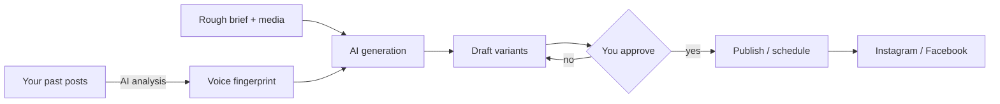

# Ghostline

An AI ghostwriting and publishing platform for content creators. You give it a
rough idea; it writes the caption and hashtags **in your voice**, you approve,
and it posts to Instagram and Facebook for you.

The impersonation is of *you*, by *you* — consented, reviewable, and revocable.

## How it works



1. **Learn** — paste captions you actually wrote. A model reverse-engineers a
   *style fingerprint*: your rhythm, punctuation habits, favourite phrases, how
   you open and close a post, what you never do.
2. **Generate** — describe the post in rough notes. The AI writes it as you,
   grounded in that fingerprint and, with vision models, in the actual image.
3. **Approve** — you edit and sign off. Nothing publishes without this.
4. **Publish** — immediately, or on a schedule.

## Ethical design

Impersonation is only acceptable when the person being impersonated stays in
control. These constraints are enforced in code, not just documented:

| Safeguard | Where |
|---|---|
| Explicit consent required at sign-up, revocable any time | `POST /api/consent`, `src/lib/publisher.ts` |
| Revoking consent instantly un-approves everything queued | `src/app/api/consent/route.ts` |
| Generation blocked without active consent | `src/app/api/generate/route.ts` |
| Publishing blocked without a human approval record | `publishPost()` in `src/lib/publisher.ts` |
| Editing an approved post automatically withdraws approval | `PATCH /api/posts/[id]` |
| The model may not invent facts, endorsements or experiences | `ETHICS_CLAUSE` in `src/lib/ai/voice.ts` |
| Optional AI-assistance disclosure appended to the post body | `disclosureText` on `Post` |
| Every generation, approval and publish is logged | `Generation`, `AuditLog` models |

The AI can only write for accounts the user personally connected via OAuth.

## Stack

- **Next.js (App Router)** + TypeScript + Tailwind
- **PostgreSQL** via Prisma
- **Auth.js (NextAuth v5)** — credentials, JWT sessions
- **Pluggable AI layer** — OpenAI, Anthropic and Google Gemini behind one
  interface (`src/lib/ai/types.ts`). Configure any one; the app falls back to
  whichever key is present, and the composer lets you pick per post.
- **Meta Graph API** — Instagram Business + Facebook Pages

## Getting started

```bash
npm install
cp .env.example .env      # then fill in the values
npx prisma migrate dev
npm run dev
```

### Required environment

| Variable | Purpose |
|---|---|
| `DATABASE_URL` | PostgreSQL connection string |
| `AUTH_SECRET` | `openssl rand -base64 32` |
| `NEXTAUTH_URL` | Base URL, e.g. `http://localhost:3000` |
| `OPENAI_API_KEY` / `ANTHROPIC_API_KEY` / `GEMINI_API_KEY` | At least one |
| `META_APP_ID`, `META_APP_SECRET` | To connect Instagram/Facebook |
| `CRON_SECRET` | Protects the scheduler endpoint |

The app runs without Meta or AI keys — those features degrade with a clear
in-app message rather than crashing.

### Connecting Meta

Instagram publishing requires an **Instagram Business or Creator account linked
to a Facebook Page**, and a Meta app with these permissions:

`pages_show_list`, `pages_read_engagement`, `pages_manage_posts`,
`instagram_basic`, `instagram_content_publish`, `business_management`

Set the OAuth redirect URI to `{NEXTAUTH_URL}/api/social/meta/callback`.

Media must live at **publicly reachable URLs** — Meta fetches images and video
server-side rather than accepting uploads from the browser.

### Scheduling

Point any cron at the scheduler endpoint; it publishes every approved post whose
time has arrived.

```bash
curl -H "Authorization: Bearer $CRON_SECRET" https://your-host/api/cron/publish
```

## Project layout

```
src/
  lib/
    ai/
      types.ts       Provider interface
      openai.ts      ┐
      anthropic.ts   ├ interchangeable implementations
      gemini.ts      ┘
      index.ts       Registry + fallback resolution
      voice.ts       Impersonation engine: style synthesis, generation, refinement
    social/meta.ts   Graph API: OAuth, IG container publish, FB page post
    publisher.ts     Publish pipeline + ethical guardrails
    auth.ts          Auth.js configuration
  app/
    compose/         Brief → AI drafts → edit → approve
    queue/           Approve, schedule, publish, retry
    voice/           Voice profile + sample corpus + training
    accounts/        Meta OAuth connections
    settings/        Consent control + activity log
    api/             REST endpoints
```

## API

| Method | Route | Purpose |
|---|---|---|
| `POST` | `/api/auth/register` | Create account (consent required) |
| `GET` `POST` | `/api/voice-profiles` | List / create voice profiles |
| `POST` | `/api/voice-profiles/[id]/learn` | Train the voice fingerprint |
| `POST` | `/api/generate` | Draft caption + hashtags in your voice |
| `POST` | `/api/refine` | Rewrite a caption, keeping the voice |
| `GET` `POST` | `/api/posts` | List / create posts |
| `POST` | `/api/posts/[id]/approve` | Human approval gate |
| `POST` | `/api/posts/[id]/publish` | Publish now |
| `POST` | `/api/posts/[id]/schedule` | Schedule or unschedule |
| `GET` | `/api/social/meta/connect` | Start Meta OAuth |
| `GET` `POST` | `/api/consent` | Read / grant / revoke consent |
| `GET` | `/api/cron/publish` | Scheduler tick |

## Compliance note

Automated posting is subject to Meta's Platform Terms and to disclosure rules in
some jurisdictions and brand agreements. Keep the AI-assistance disclosure
enabled unless you have confirmed it is unnecessary for your situation.
